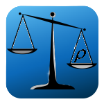

# EDRMedeso Apps

## CloudConnect

 [CloudConnect](https://edromedeso.github.io/cloudconnect_mechanical/) Ansys Mechanical

 [CloudConnect](https://edromedeso.github.io/cloudconnect_fluent/) Ansys Fluent

## Productivity Tools

 [Bolt Toolkit](https://edromedeso.github.io/BoltToolkit) Ansys Mechanical

 [Weld Toolkit](https://edromedeso.github.io/WeldToolkit) Ansys Mechanical

 [Report Generator](https://edromedeso.github.io/ReportGenerator) Ansys Mechanical

## Free Apps

 [ASME Material Generator](https://edromedeso.github.io/ACT_ASME_MaterialGenerator) Ansys Workbench

 [CSV Plot](https://edromedeso.github.io/ACT_CSVPlot) Ansys Mechanical

 [Density Scaling](https://edromedeso.github.io/ACT_Density_scaling) Ansys Mechanical
